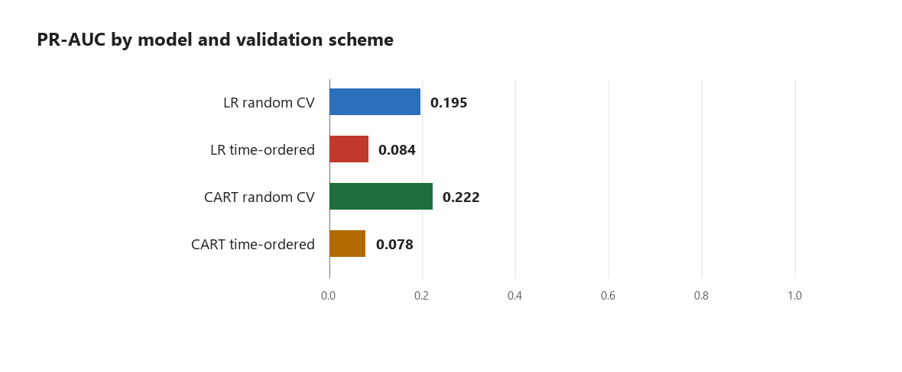
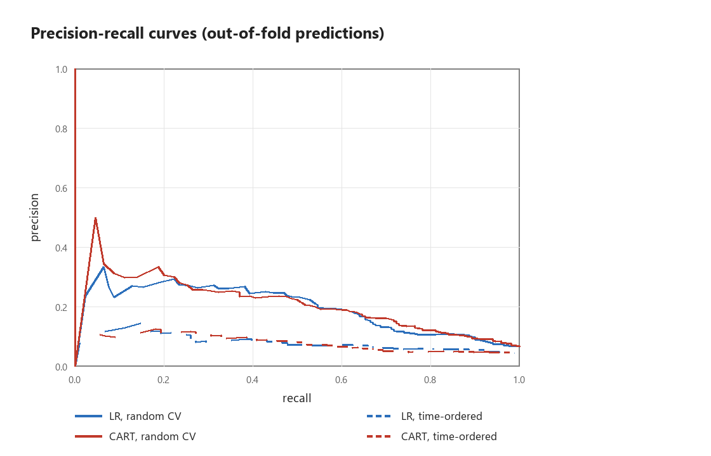
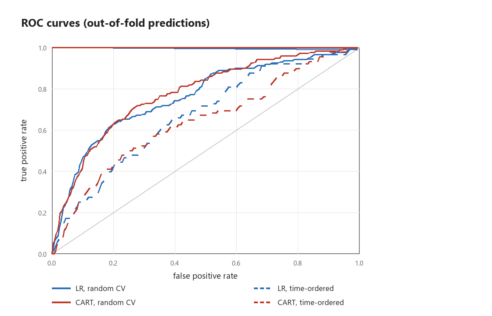

# Validation and calibration of seismic bump forecasting models

Junjie Yang

Mining Engineering, Fuzhou University

Revised 2 October 2026. Code and result files: https://github.com/junjie-yang11/seismic-bump-forecasting

## Abstract

This study compares random stratified validation, validation in record order, and a chronological holdout on the UCI Seismic Bumps mirror. Performance varies with the protocol. The original comparison uses different test populations, so its PR-AUC gap combines test composition, prevalence drift, training history and possible temporal leakage. The same-test comparison below controls the test rows but does not isolate a causal leakage effect. Calibration priors and alert thresholds are now derived separately inside each training fold.

## 1 Data and scope

The mirror contains 2578 records and 170 positives. Overall prevalence is 0.0659. There are no duplicate rows in this mirror. The task is prediction of hazardous seismic events in the next shift. Row order is used as a temporal proxy; explicit timestamps and longwall identifiers are unavailable. The results are conditional on this order representing a meaningful forecasting sequence. The mirror has six fewer rows than the original 2584-record dataset.

The model uses 17 encoded features after removing nbumps. Three retained columns are constant: nbumps6, nbumps7 and nbumps89. Dropping nbumps does not make the design matrix full rank; L2 regularization and constant-safe standardization allow the logistic model to fit.

| Record block | 1 | 2 | 3 | 4 | 5 |
| --- | --- | --- | --- | --- | --- |
| Prevalence | 0.1609 | 0.0680 | 0.0213 | 0.0447 | 0.0349 |

## 2 Models and validation

Logistic regression is fitted with IRLS, L2 penalty 1.0, an unpenalized intercept and balanced class weights. Its feature standardization is fitted inside training only. CART uses 60 ordinary bootstrap trees, depth 6, minimum 20 observations per leaf and unweighted Gini impurity. Its leaf probabilities are unweighted sample proportions; CART receives no balanced-prior correction.

Random stratified validation uses ten folds and seeds 0 to 4. All metrics in its aggregate table are averaged over those five seeds. Record-order validation divides the data into five consecutive blocks and evaluates four expanding training windows. The first block is training only. Holdout uses the first 70 percent for training and the last 30 percent for testing. Test blocks with zero positives are retained; single-class ROC-AUC is undefined rather than being used to suppress their predictions.

## 3 Thresholds and calibration

Each outer training fold has an inner split. Record-order folds reserve the last 20 percent of available training history for threshold reference; random folds reserve 20 percent of each training class with seed 7. An inner model predicts these reference rows. The alert budget is the positive proportion in its inner fit data. The threshold excludes the boundary score and all ties at that boundary, so the reference alert count never exceeds the integer budget. The outer model is refitted on its full training fold and evaluated with this fixed numerical threshold. Test labels and test score quantiles never select the threshold. Refitting and distribution drift can change the future alert rate; the budget is not a promise of an exact test alert rate.

For weighted logistic regression, prior correction shifts log odds from effective prior 0.5 to that outer fold's training prevalence. Correction is performed before pooling the calibrated predictions. Its adequacy under distribution drift remains empirical. Ranking metrics below use raw scores. Brier skill uses the evaluation prevalence as a retrospective oracle constant reference, not as a deployable forecast or calibration prior.

## 4 Validation results

| Model | Validation | ROC AUC | PR AUC | Recall | Alert rate |
| --- | --- | --- | --- | --- | --- |
| LR | Random | 0.7547 | 0.1952 | 0.2635 | 0.0654 |
| LR | Record order | 0.6678 | 0.0838 | 0.1932 | 0.1832 |
| CART | Random | 0.7743 | 0.2217 | 0.3024 | 0.0763 |
| CART | Record order | 0.6403 | 0.0784 | 0.0909 | 0.0911 |

Accuracy, precision, F1 and balanced accuracy are included in results/metrics_by_scheme.csv; seed-level metrics are in random_metrics_by_seed.csv.

The two schemes evaluate different populations. Random validation covers all records, whereas record-order validation excludes the first training-only block. Their positive proportions differ. The original approximately 57 percent LR PR-AUC reduction cannot be assigned wholly to temporal leakage.

### Same test rows

| Model | Test n | Prevalence | Random PR AUC | Order PR AUC |
| --- | --- | --- | --- | --- |
| LR | 2063 | 0.0427 | 0.0953 | 0.0838 |
| CART | 2063 | 0.0427 | 0.0972 | 0.0784 |

Random scores are restricted to the exact rows covered by record-order validation, and averaged over the same five seeds. This controls test composition. Training sizes, permitted training periods and cross-fold score scales still differ; this is a sensitivity analysis, not an estimate of a pure leakage percentage. Per-seed results are in shared_test_by_seed.csv.

## 5 Holdout and probability calibration

| Model | ROC AUC | PR AUC | Recall | Precision | Alert rate |
| --- | --- | --- | --- | --- | --- |
| LR | 0.5679 | 0.0897 | 0.0769 | 0.2500 | 0.0103 |
| CART | 0.6122 | 0.0874 | 0.0385 | 0.1667 | 0.0078 |

These holdout operating metrics use fixed thresholds selected on training validation rows. They replace the earlier retrospective test-quantile metrics.

| Model | Variant | Brier | ECE | Mean prediction | Observed |
| --- | --- | --- | --- | --- | --- |
| LR | As fitted | 0.1462 | 0.2904 | 0.3331 | 0.0427 |
| LR | Fold prior correction | 0.0439 | 0.0271 | 0.0694 | 0.0427 |
| CART | As fitted | 0.0433 | 0.0374 | 0.0662 | 0.0427 |

Calibration numbers in this table come directly from results/calibration.csv. MCE and Brier skill are available in that file. Only LR has a corrected variant.

## 6 Record index probe and feature importance

| Model | Validation | ROC AUC | PR AUC |
| --- | --- | --- | --- |
| LR | Random seed 0 | 0.7619 | 0.2065 |
| LR | Record order | 0.6093 | 0.0630 |
| CART | Random seed 0 | 0.8040 | 0.2807 |
| CART | Record order | 0.6694 | 0.0850 |

The record index is a proxy for sequence position, not a physical monitoring variable. Its effect suggests sensitivity to record structure but does not prove a unique leakage mechanism. Both random probe and corresponding raw score reference should be compared at seed 0.

| Feature | In sample ROC AUC drop | Standard deviation |
| --- | --- | --- |
| nbumps2 | 0.0645 | 0.0051 |
| gpuls | 0.0562 | 0.0040 |
| energy | 0.0522 | 0.0043 |
| genergy | 0.0431 | 0.0027 |
| gdenergy | 0.0291 | 0.0021 |
| gdpuls | 0.0219 | 0.0031 |
| shift | 0.0099 | 0.0018 |
| nbumps3 | 0.0094 | 0.0018 |

Permutation importance is measured on the data used to fit the forest and is descriptive. It is not independent evidence of future feature usefulness. Correlated monitoring features can mask one another's contributions.

## 7 Limitations and reproducibility

No timestamp or wall identifier confirms the ordering assumption. No hyperparameter search or confidence interval for temporally correlated observations is provided. Inner model thresholds are transferred to a refitted outer model, so score-scale changes remain a limitation. Prior correction alone does not establish reliable deployment probabilities.

Run python run_experiments.py, python -m unittest discover -s tests -v, and python verify_results.py. The verifier recomputes metrics from stored predictions, checks training-only priors and fixed thresholds, tests required row coverage and compares generated report text with result files. It does not claim that numerical agreement proves the scientific assumptions.

Run python generate_report.py --docx with requirements-report.txt installed, then run export_report.ps1 on Windows with Microsoft Word installed. Markdown and Word are generated from the same report source; the PDF is exported from Word.

## References

Sikora M and Wrobel L (2010). Application of rule induction algorithms for analysis of data collected by seismic hazard monitoring systems in coal mines. Archives of Mining Sciences 55(1), 91-114.

UCI Machine Learning Repository. Seismic Bumps dataset. https://archive.ics.uci.edu/ml/datasets/seismic-bumps

Bergmeir C and Benitez JM (2012). On the use of cross-validation for time series predictor evaluation. Information Sciences 191, 192-213.

Roberts DR et al (2017). Cross-validation strategies for data with temporal, spatial, hierarchical, or phylogenetic structure. Ecography 40, 913-929.
