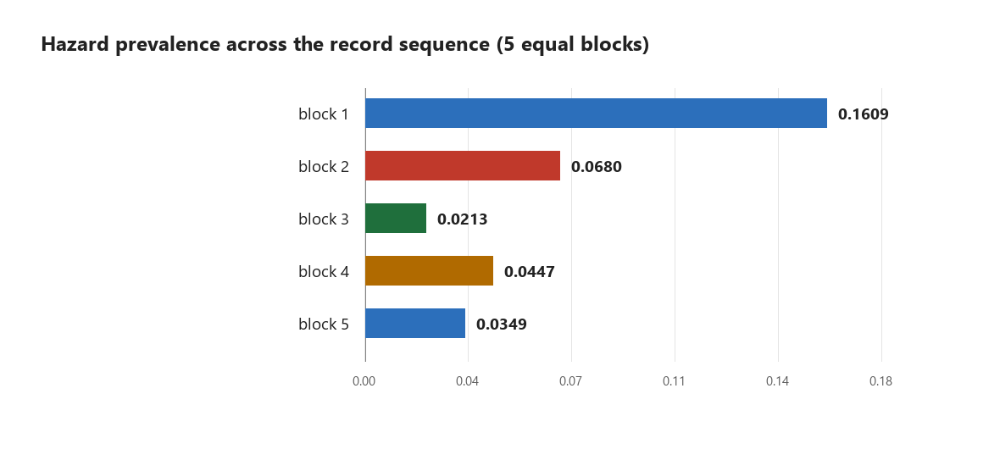
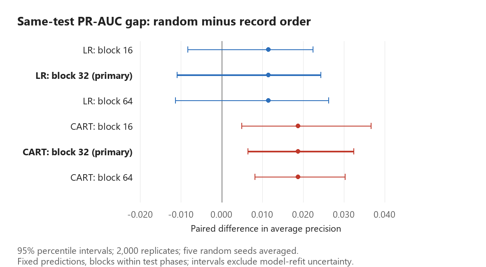
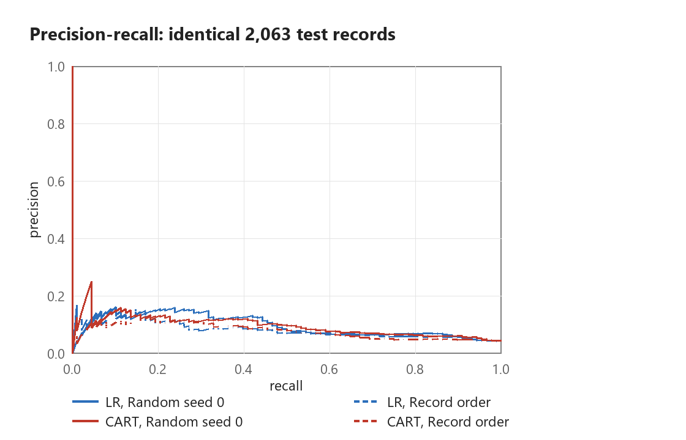
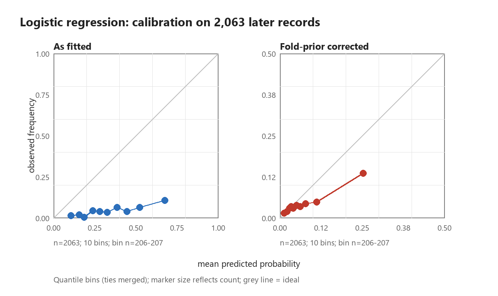

# When the validation gap shrinks: test-cohort composition, warning thresholds and calibration in seismic bump forecasting

Junjie Yang

Mining Engineering, Fuzhou University

Research code: https://github.com/junjie-yang11/seismic-bump-forecasting

## Abstract

Most of the apparent random-versus-record-order performance gap in this study disappears when the same test records are evaluated. On a 2,578-row mirror of the UCI Seismic Bumps dataset, restricting random out-of-fold scores to the 2,063 records covered by record-order validation reduces the absolute PR-AUC gap by 89.7 percent for logistic regression (LR) and 86.9 percent for bagged CART. The remaining differences are 0.0114 and 0.0188; phase-stratified paired moving-block bootstrap 95 percent intervals are [-0.0110, 0.0243] and [0.0064, 0.0323], respectively. These are conditional uncertainty estimates for fixed predictions, and the gap reduction is a descriptive cohort sensitivity result rather than a causal decomposition of leakage. Operational performance remains weak: LR detects only 2 of 26 hazardous holdout shifts at its training-derived threshold. Fold-local prior correction reduces LR expected calibration error from 0.2904 to 0.0271 and Brier score from 0.1462 to 0.0439, but corrected forecasts still have negative Brier skill against a retrospective constant baseline. The contribution is a reproducible engineering evaluation that distinguishes ranking, probability calibration and warning-policy transfer before considering field deployment.

Keywords: mining engineering; seismic hazard; rare-event prediction; test-cohort shift; paired block bootstrap; probability calibration

## 1 Introduction

A useful mine-warning model must identify hazardous shifts early enough to support a defined operational response. A high accuracy score alone is insufficient when hazardous events are rare: always predicting the negative class achieves 93.41 percent accuracy in this mirror. The UCI target records whether an event above 10^4 J occurs in the next shift; it is a proxy for elevated seismic activity, not a direct rockburst or injury label [1]. This distinction matters because the consequences of a missed warning and the costs of repeated inspections are operational quantities, not properties of an AUC metric.

Evaluation must therefore answer three different questions: whether higher scores rank hazardous shifts above safe shifts, whether a score can be interpreted as a probability, and whether a numerical warning threshold continues to work in a later period. Temporal or spatial structure can invalidate a simple random-split interpretation [3,4]. Yet a protocol comparison also changes which records are tested and how much training history is available. This paper tests the sensitivity of the apparent validation gap to a common test cohort, estimates the remaining paired difference, and examines calibration and warning thresholds as separate engineering outcomes.

This study uses tabular monitoring data and two interpretable baseline model families. Its image-data relevance concerns evaluation design: audit provenance, keep related observations together, prevent test information entering model decisions, and report operational consequences. Section 5.3 develops this transfer.

## 2 Data provenance and engineering scope

### 2.1 Original dataset and mirror

The original UCI file has 2584 shifts from two Polish mine longwalls [1]. The CSV mirror documents removal of repeated rows [2]. A direct comparison of the downloaded ARFF and the local CSV confirms that keeping the first occurrence of each complete row reproduces all 2578 mirror rows in the same order. The six removed rows are exact duplicates and all have class 0; all 170 positive rows remain. Table 1 records the original one-based row IDs. File hashes, complete duplicate contents and the mirror-to-original row mapping are saved in source_audit.json, source_duplicates.csv and source_row_mapping.csv.

Table 1. Exact duplicate rows excluded by the mirror; row IDs refer to the original UCI data records, excluding the ARFF header.

| Removed row | Retained first row | Target class |
| --- | --- | --- |
| 90 | 88 | 0 |
| 91 | 89 | 0 |
| 973 | 971 | 0 |
| 974 | 972 | 0 |
| 1018 | 1016 | 0 |
| 1019 | 1017 | 0 |

Identical measurements may arise in distinct shifts, so this audit confirms the mirror transformation rather than establishing that the removed records were invalid. Removing six negatives slightly changes prevalence and index spacing; results should not be compared as if they were evaluations of all 2,584 original records. The order-preserving transformation also does not prove that the original file is a single chronological sequence. Explicit timestamps and longwall identifiers are absent.

### 2.2 Predictors and target

Each record summarizes one eight-hour shift. Predictor groups include mine hazard assessments, geophone energy and pulse measures, deviations from preceding-shift reference levels, bump counts by energy range, and total or maximum bump energy [1]. The target refers to the following shift. This measurement-to-target timing is essential when reconstructing a field prediction task. Ordinal categorical encoding and removal of total nbumps leave 17 input columns. Three retained bump-count columns are constant; regularized LR and constant-safe scaling allow fitting without claiming full matrix rank.

The first record-order block has a much larger positive proportion than later blocks (Figure 1). Random validation covers all 2,578 rows with prevalence 0.0659; the common later test cohort contains 88 positives among 2,063 rows, prevalence 0.0427. These are different evaluation populations, even when the underlying model family is unchanged.

## 3 Methods

### 3.1 Models and validation protocols

LR uses IRLS, L2 penalty 1.0, an unpenalized intercept and balanced class weights. Scaling is fitted on training rows only. The tree baseline uses 60 ordinary bootstrap CART trees, depth 6 and at least 20 observations per leaf, with unweighted Gini impurity and unweighted leaf probabilities. No hyperparameter search is conducted. These baselines assess evaluation behavior rather than seek a state-of-the-art score.

Random stratified validation has ten folds and five seeds, 0 to 4. Every aggregate random metric is the mean of the five seed-specific metrics. Record-order validation divides the mirror into five consecutive blocks; four expanding windows train on earlier blocks and test the next one. The first block is training only. The final holdout trains on the first 70 percent and tests the last 774 rows. All test rows, including all-negative blocks, are retained. ROC-AUC is undefined for a single-class cohort; PR-AUC here means non-interpolated average precision, with ties grouped before integration.

### 3.2 Common test cohort and paired uncertainty

Random predictions for each seed are restricted to the exact 2,063 rows covered by record-order validation. The reported difference is the mean random average precision across five seeds minus the temporal average precision. This averages metrics, not probabilities. Seeds quantify split sensitivity and are not treated as five independent samples from the mine population.

The primary interval uses 2,000 paired moving-block bootstrap replicates, block length 32 records and fixed random generator seed 20261002. For every replicate, contiguous blocks are sampled with replacement separately within each of the four temporal test phases, preserving each phase size; the final block is truncated. The identical sampled row indices are applied to labels, all five random prediction vectors and the temporal vector. The statistic is recomputed on each resampled cohort, and its 2.5th and 97.5th percentiles form a conditional interval. Block lengths 16 and 64, plus phase-stratified paired IID resampling, are sensitivity checks. Blocks preserve some local dependence [5] but cannot recover missing timestamps or guarantee correct coverage under nonstationary mine conditions. No models are refitted during resampling; training-set and model-fit uncertainty are excluded.

### 3.3 Warning thresholds and probability correction

Each outer training fold has an inner split: temporal folds reserve the latest 20 percent of training rows, while random folds reserve 20 percent within each class. An inner model scores these reference rows; its own training prevalence sets a reference alert budget. The boundary score and all its ties are excluded together so the reference count cannot exceed the integer budget. The outer model is refitted on its full training fold and evaluated using that fixed numerical threshold. Neither test labels nor test score quantiles select the threshold. The budget is a training-reference ranking heuristic, not a cost-optimal mine warning policy or an enforced percentage of future alerts.

For balanced-weight LR, a log-odds offset converts the effective training prior of 0.5 to each outer training fold's unweighted positive proportion. The transformation is applied fold by fold before pooling calibration predictions. CART is unweighted and receives no such correction. A correction with one fixed prior is monotone and preserves rankings within that fold; different corrections across folds can change the pooled ordering. The discrimination tables use raw scores, so improved calibration is not presented as improved discrimination.

Calibration uses Brier score, expected calibration error (ECE), maximum calibration error and reliability diagrams. Ten quantile bins are requested; repeated edges are merged and tied scores remain together. ECE depends on the binning choice and is not by itself proof of calibrated individual probabilities. Brier skill is reported against an evaluation-prevalence constant predictor, explicitly a retrospective oracle reference rather than a deployable training baseline.

## 4 Results

### 4.1 Most of the apparent gap is sensitive to test-cohort composition

Table 2 retains the original different-cohort comparison alongside the common-cohort result. The absolute gap shrinks by 89.7 percent for LR and 86.9 percent for CART when the early training-only records are removed from random evaluation. The fitted random models are unchanged in this restriction; the evaluation population changes. This establishes a large sensitivity to test composition, including prevalence and record difficulty. It does not assign the reduction to prevalence alone or estimate the share caused by leakage.

Table 2. Absolute random-minus-record-order PR-AUC gaps before and after matching test rows; reduction is descriptive.

| Model | Different-cohort gap | Same-cohort gap | Gap reduction |
| --- | --- | --- | --- |
| LR | 0.1114 | 0.0114 | 89.7% |
| CART | 0.1433 | 0.0188 | 86.9% |

Table 3. Common-cohort average precision and primary paired 95 percent moving-block intervals (2,063 rows, 88 positives; block length 32). Differences use unrounded metrics.

| Model | Random mean AP | Record-order AP | Difference | 95% interval |
| --- | --- | --- | --- | --- |
| LR | 0.0953 | 0.0838 | 0.0114 | [-0.0110, 0.0243] |
| CART | 0.0972 | 0.0784 | 0.0188 | [0.0064, 0.0323] |

Across the five random fold assignments, the common-cohort AP difference ranges from 0.0088 to 0.0128 for LR and from 0.0169 to 0.0223 for CART. These ranges describe split sensitivity, not confidence intervals or independent mine replications.

Figure 2 shows the primary intervals and block-length sensitivity. The LR interval crosses zero; the CART interval remains above zero across the examined block lengths. The two models therefore do not support the same residual-gap statement. Inclusion of zero means that this conditional resampling analysis does not clearly distinguish a residual difference from zero; it does not establish equivalence. Exclusion of zero would indicate a difference under these resampling assumptions, not prove its cause. Training sizes, allowed training periods and pooled score scales remain different.

Figure 3 compares the same evaluation cohort for both protocols. Its common positive proportion, 0.0427, is the prevalence reference for interpreting average precision. The plot is a visualization of one random seed, not a substitute for the seed means or uncertainty analysis.

### 4.2 Calibration improves, but remains insufficient for deployment

Fold-local LR prior correction reduces ECE from 0.2904 to 0.0271 and Brier score from 0.1462 to 0.0439 (Table 4). Mean predicted probability falls from 0.3331 to 0.0694 against observed prevalence 0.0427. This is a substantial empirical improvement in probability scale, despite the remaining overprediction. Corrected LR Brier skill is -0.0751 and unweighted CART Brier skill is -0.0607 against the oracle constant reference, so neither outperforms that reference in squared probability error.

Table 4. Probability assessment on record-order test rows. Correction uses training priors, and only LR has a corrected variant.

| Model / variant | Brier | ECE | Mean forecast | Observed |
| --- | --- | --- | --- | --- |
| LR / raw | 0.1462 | 0.2904 | 0.3331 | 0.0427 |
| LR / fold prior | 0.0439 | 0.0271 | 0.0694 | 0.0427 |
| CART / raw | 0.0433 | 0.0374 | 0.0662 | 0.0427 |

The bin summaries in calibration_bins.csv conserve all test observations. Apparent scarcity of points near zero can reflect overlapping bins at the plotted scale rather than omitted samples. Improved ECE should be interpreted together with Brier skill and the observed-versus-predicted mean, rather than as a deployment certificate.

### 4.3 A training-derived threshold can produce very few future alerts

Table 5 reports fixed-threshold holdout performance. For LR, 8 of 774 shifts are flagged, including 2 true positives and 6 false positives; 24 of 26 hazardous shifts are missed. Recall is 0.0769 and the alert rate is 0.0103. CART is also weak at this operating point. These counts are the relevant warning consequences hidden by the high overall accuracy.

Table 5. Chronological holdout warning outcomes, using frozen numerical thresholds selected inside training.

| Model | Hazardous shifts | Alerts | Detected | Missed | Recall |
| --- | --- | --- | --- | --- | --- |
| LR | 26 | 8 | 2 | 24 | 0.0769 |
| CART | 26 | 6 | 1 | 25 | 0.0385 |

The nominal budget belongs to the historical inner-reference data; it is not imposed on the holdout. A fixed score cutoff can nearly stop issuing alerts when future score distributions change. The holdout also has lower positive prevalence, but this alone does not establish why alerting collapses: feature drift and refitting can change the score scale. The converse appears in pooled temporal LR, whose alert rate is 0.1832 despite a later test prevalence of 0.0427. Threshold transfer therefore requires its own evaluation rather than an assumed constant budget.

## 5 Discussion: from model scores to mine decisions

### 5.1 Engineering interpretation

The three results address separate failure modes. A validation gap can be driven by a changed test cohort; a probability scale can be distorted by weighted fitting; and a fixed threshold can fail to transfer to later operating conditions. Treating these as one leakage story obscures different remedies. The present models show useful ranking above prevalence in the later cohort, but that does not translate into adequate detection at the chosen holdout operating point.

Before a field trial, the decision unit should be defined as a shift, work area or inspection target, with a clear prediction lead time and escalation action. A warning policy should specify acceptable missed-event consequences, available inspection capacity and alert burden, using only training or prospective validation data. On-site context such as face advance, work activity, sensor changes and monitoring coverage could help investigate distribution changes; these variables are not identified or tested here. The model should support qualified monitoring and investigation rather than convert an AUC into an autonomous safety action.

### 5.2 Limits and next experiments

The data do not identify timestamps or longwalls, so the chronological interpretation and dependence horizon remain assumptions. The moving-block intervals condition on observed predictions and empirical test phases, and are not full uncertainty estimates for future mines. Block length 32 is a transparent analysis choice rather than an identified dependence horizon. A next experiment should retain the original 2,584-record version, compare matched training sizes, examine per-phase discrimination and calibration, and evaluate a frozen policy prospectively. More complex models should follow these checks rather than precede them.

The record-index probe and in-sample permutation importance remain descriptive diagnostics in leakage_probe.csv and importance.csv. They suggest sensitivity to record structure and correlated predictors but do not independently establish temporal leakage or future feature usefulness.

### 5.3 Transferable lessons for UAV and mine-image data

A comparable image study would define the inspection target before choosing an algorithm: for example, locating a visible surface defect or mapping a feature that requires follow-up. Nearby frames, overlapping image tiles and repeated views of the same area should be grouped by flight, site and acquisition period for validation, since a random image split may put nearly identical views on both sides. Common test sites and periods would make protocol comparisons interpretable. Spatial resolution, image quality and annotation consistency would be audited as measurement conditions, while missed targets and review workload would be reported separately from recognition accuracy. These are proposed design principles, not results of a UAV experiment in this repository.

## 6 Conclusions

Matching test records removes most of the apparent random-versus-record-order PR-AUC gap in this experiment, demonstrating why cohort composition must be controlled before attributing a protocol difference to leakage. The paired analysis quantifies the smaller residual gap under explicit dependence assumptions. Fold-local prior correction improves probability error substantially, but negative Brier skill and weak holdout warning counts show that calibration improvement and a ranking score are insufficient evidence of operational readiness. The main contribution is a traceable evaluation workflow linking mine-monitoring data, statistical checks and warning consequences.

## Data and code availability

Source data are available from UCI [1] and the CSV mirror [2]. The repository contains analysis code, row-level OOF predictions for all five random seeds, paired-bootstrap replicates, provenance hashes, fold audits and generated reports. Run audit_source.py to audit a supplied original ARFF or download it, then run run_experiments.py, the unittest suite and verify_results.py --reports after regenerating Word and PDF. The analysis uses NumPy, pandas and Pillow; Word generation uses python-docx and PDF export uses Microsoft Word on Windows.

## References

[1] Sikora M, Wrobel L. Seismic Bumps [Dataset]. UCI Machine Learning Repository, 2010. DOI: 10.24432/C5W902. https://archive.ics.uci.edu/dataset/266/seismic+bumps

[2] datasets/seismic-bumps. CSV mirror and preparation description: repeated-row removal. https://github.com/datasets/seismic-bumps

[3] Bergmeir C, Benitez JM. On the use of cross-validation for time series predictor evaluation. Information Sciences, 2012, 191:192-213.

[4] Roberts DR et al. Cross-validation strategies for data with temporal, spatial, hierarchical, or phylogenetic structure. Ecography, 2017, 40:913-929.

[5] Shalizi CR. Simulation for Inference I: The Bootstrap. Carnegie Mellon University course notes, 2018. https://stat.cmu.edu/~cshalizi/dst/18/lectures/18/lecture-18.html
