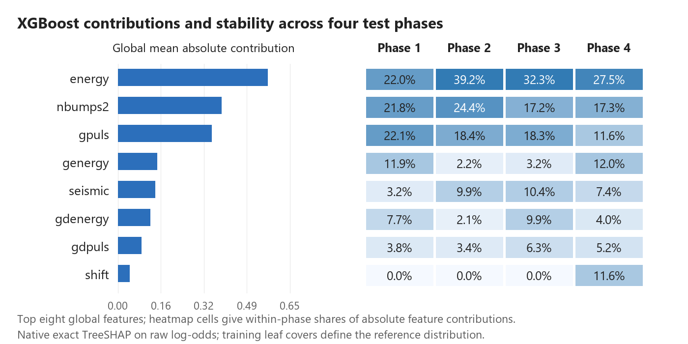
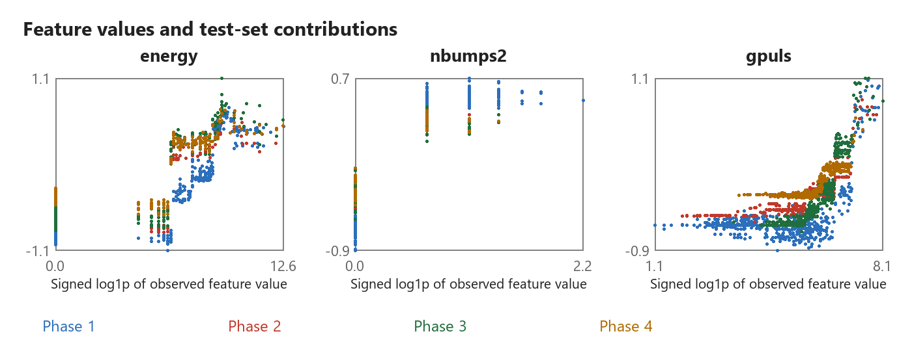
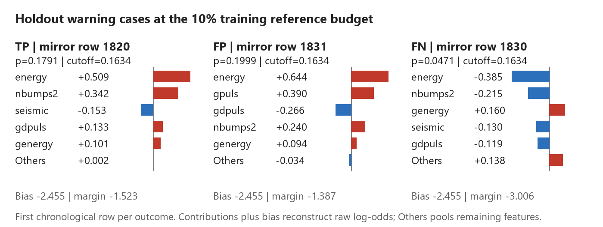
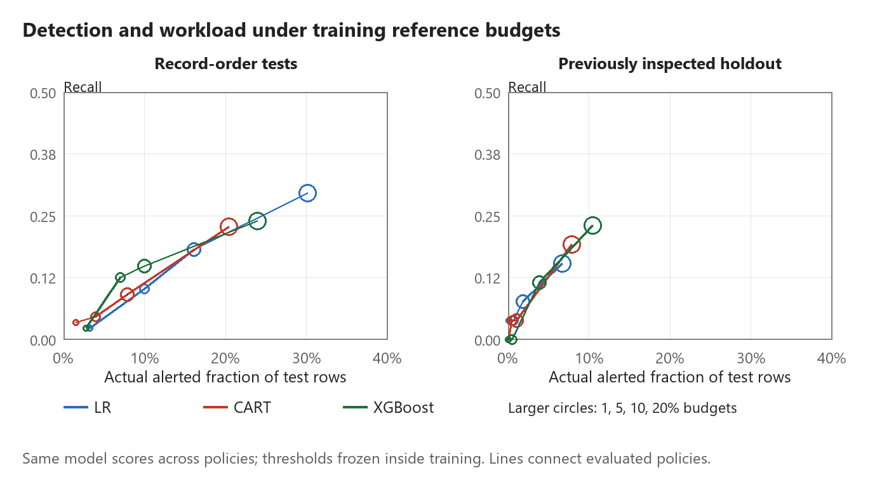

# Evaluating reliability and explainability in seismic hazard forecasting for underground mine monitoring

Junjie Yang

Mining Engineering, Fuzhou University

Research code: https://github.com/junjie-yang11/seismic-bump-forecasting

## Abstract

Test-cohort composition materially changes the apparent validation gap in seismic hazard forecasting. We evaluate logistic regression (LR), bagged CART and training-tuned XGBoost on 2,063 common test rows from the 2,578-row UCI Seismic Bumps mirror. Record order serves as a temporal proxy because timestamps and longwall identifiers are absent. Matching test rows reduces the apparent random-versus-record-order average-precision gap by 89.7 percent for LR and 86.9 percent for CART. Residual differences are 0.0114 (95 percent interval [-0.0110, 0.0243]) and 0.0188 ([0.0064, 0.0323]), respectively. These changes quantify sensitivity to evaluation-cohort composition. Training-prior correction improves LR expected calibration error from 0.2904 to 0.0271 and Brier score from 0.1462 to 0.0439. Corrected LR Brier skill is 0.0342 against the historical training-prior reference and -0.0751 against the retrospective test-prevalence reference. Nine prespecified feature combinations assess the predictive information in hazard ratings, geophone signals, seismic activity and shift type. Exact TreeSHAP identifies total seismic energy, low-energy event counts and pulse activity as recurring contributors to XGBoost predictions; comparison with refitted feature ablations distinguishes model reliance from incremental predictive value. At training reference budgets of 10 and 20 percent, supplementary holdout XGBoost produces 30 and 81 alerts and detects 3 and 6 of 26 hazardous shifts. The results distinguish three properties needed for engineering interpretation: performance on comparable shifts, the probability scale of the forecasts and the detection workload of a warning rule. Paired intervals describe uncertainty conditional on fixed predictions.

Keywords: mining engineering; seismic hazard forecasting; engineering feature ablation; TreeSHAP; explanation stability; warning budget

## 1 Introduction

Underground mine monitoring records rock-mass activity to support the assessment of hazardous conditions. Interpreting a forecast for engineering review requires evidence about its performance on later shifts, the monitoring signals it uses and the inspections its warnings would trigger. These questions connect model evaluation to detected hazards, missed hazardous shifts and false-alert workload.

The UCI Seismic Bumps data provide a defined next-shift forecasting task: each record summarizes an eight-hour shift, and the target indicates whether the following shift contains a seismic event above 10,000 J [1]. Existing seismic and seismoacoustic hazard ratings appear alongside energy, pulse and event-count measurements. Their coexistence makes the additional predictive information in measured signals testable against the recorded assessments. The target is next-shift high-energy seismic occurrence; confirmed rockburst accidents are outside its label definition.

Validation protocols can change both the training history and the test population [3,4]. Comparing their scores on different shifts can therefore obscure the source of an apparent performance gap. A common test cohort makes that comparison interpretable, while probability assessment determines what the score scale conveys. Feature ablation, model explanations and frozen thresholds then connect the monitoring inputs to predictive contribution and warning workload.

This study examines how evaluation-cohort composition changes the validation gap and how monitoring information translates into forecasts and warning decisions. The common cohort supports comparisons across three model families, and nine prespecified feature combinations test the contribution of each engineering group. Exact TreeSHAP traces how the fitted XGBoost models use these signals across four test phases; comparison with refitted ablations separates model reliance from observed predictive gains. Four training reference budgets quantify detections, missed shifts and inspection workload after threshold transfer. All comparisons use saved row-level predictions and explicit training-only selection rules.

## 2 Data and engineering feature hypotheses

### 2.1 Dataset and provenance

The original UCI dataset contains 2,584 records from two longwalls of a Polish coal mine, with 170 positive target records [1]. The positive count refers to labelled shift records, rather than a catalogue of 170 independently identified seismic events. The CSV mirror retains 2,578 records [2]. A direct ARFF-to-CSV audit confirms first-occurrence deduplication without reordering: six excluded original rows, 90, 91, 973, 974, 1018 and 1019, are exact duplicate negatives. All positive records remain. The content-identical first-occurrence records retained for these rows have original IDs 88, 89, 971, 972, 1016 and 1017, respectively. These IDs are one-based data-row numbers excluding the ARFF header.

Row order is used as the temporal proxy because explicit timestamps and longwall identifiers are absent. The initial training block contains 15.92 percent positive records, compared with 6.98, 1.94, 4.65, 3.49 percent in the four subsequent test phases. Exact phase counts and prevalence are provided in Table 7. The full dataset prevalence is 6.59 percent, whereas the common test cohort has 88 positives among 2,063 records, or 4.27 percent. These differences motivate both matched evaluation and phase-specific analysis.

### 2.2 Engineering feature groups

Table 1 partitions the existing 17-column design into four engineering groups. The three hazard-rating variables encode recorded assessments, while the geophone and seismic-activity groups contain monitoring measurements. Shift type describes preparation or coal-getting activity. These groups define comparisons between existing hazard assessments and the measured signals available to a forecasting model.

Table 1. Engineering feature groups and the predictive hypotheses examined.

| Group | Variables | Question |
| --- | --- | --- |
| Hazard ratings | seismic, seismoacoustic, ghazard | How much information is already represented by recorded assessments? |
| Geophone | genergy, gpuls, gdenergy, gdpuls | Do energy, pulse activity and deviations add information beyond ratings? |
| Seismic activity | nbumps2 to nbumps89, energy, maxenergy | Do event counts by energy band and released-energy measures add information? |
| Operation | shift | Does shift type provide predictive context? |

Categorical fields retain the existing ordinal encoding. The total count nbumps is excluded from the retained 17-column design, which includes the energy-band counts. Constant energy-band columns remain in the audited design. LR uses constant-safe training standardization and L2 regularization. The design uses the supplied shift summaries; constructing cross-shift lag features would require known longwall continuity.

## 3 Methods

### 3.1 Common test cohort and model comparison

Record-order evaluation divides the mirror into five consecutive blocks. Four expanding-window fits train on earlier blocks and predict the next block; the first block supplies training only. Every model and feature combination therefore evaluates the same 2,063 rows. A supplementary holdout trains on the first 70 percent and evaluates the last 774 records, containing 26 positive targets. This holdout was inspected in the earlier project, so it is reported as descriptive supplementary evidence and is not used to select a feature set, model or budget.

LR retains L2 penalty 1.0, an unpenalized intercept and balanced class weights. Bagged CART retains 60 ordinary bootstrap trees, maximum depth 6, minimum leaf size 20, unweighted Gini and forest seed 7. XGBoost uses unweighted binary logistic loss and histogram trees, learning rate 0.05, minimum child weight 10 and L2 penalty 5.0, with full row and column sampling, seed 7 and two CPU threads [6]. Its fixed candidate grid combines depth 2 or 3 with 80 or 160 boosting rounds.

Each XGBoost search uses only its supplied training rows: the final 20 percent forms an inner reference, and candidates are fitted on the preceding 80 percent. Selection maximizes tied-score average precision (AP), with negative Brier score as the predefined fallback for a zero-positive reference; the first grid entry wins exact ties. The selected model is refitted on the entire supplied training set. Threshold-reference models conduct their own search within the earlier inner-fit prefix. For feature ablations, full-feature training selects parameters once per fold and the same choices are used for all nine feature combinations.

The random protocol uses ten stratified folds and five seeds, 0 to 4. XGBoost selects parameters through a stratified inner split within each outer training fold. Random predictions are restricted to the record-order test cohort before calculating comparative metrics. Reported random AP is the mean of five seed-specific AP values, rather than AP after averaging scores. LR and CART retain fixed settings; XGBoost is training-tuned. Comparisons characterize these stated workflows rather than equally extensive searches for every model.

### 3.2 Feature comparisons and conditional uncertainty

The prespecified feature sets are the full design, each group alone and the design with each group removed. They are all reported, without choosing a final feature set from test outcomes. The full-versus-ratings-only contrast addresses the additional predictive information in monitoring measurements and shift type. Group-removal contrasts assess predictive dependence on information groups in the presence of correlated alternatives.

AP is the main ranking measure and groups tied scores before integration. ROC-AUC, Brier score and ten-quantile-bin expected calibration error (ECE) provide complementary discrimination and probability assessments. LR probability assessment uses each outer training fold's unweighted prior to correct its balanced-weight output; CART and XGBoost are assessed as fitted. No test-label prior is used in forecasting or calibration.

Paired moving-block intervals use 2,000 replicates, block length 32 and RNG seed 20261002. Contiguous blocks are sampled separately within each test phase, preserving phase sizes and applying identical sampled rows to every compared score vector. Intervals are the 2.5th and 97.5th percentiles of paired AP differences and condition on fixed predictions. Random-protocol differences average the five seed-specific AP values within each replicate. The earlier LR/CART protocol analysis also checks lengths 16 and 64. The intervals are descriptive, unadjusted for multiple feature contrasts, and exclude model-refit and parameter-selection uncertainty [5].

### 3.3 Explanations and phase stability

Full-feature XGBoost models explain their own outer-test predictions through native exact TreeSHAP, using the training-derived leaf covers as the tree-path-dependent reference [7,8]. Each row has 17 feature contributions and a bias term. Their sum reconstructs the raw log-odds margin; applying the logistic function reconstructs the predicted probability. Contributions are additive on the model's log-odds scale and describe fitted predictive associations.

Global importance is mean absolute contribution on the common test cohort. Each phase also has its own importance ranks. Pairwise Spearman correlations compare the ranks of all 17 features, with average ranks for ties; top-five Jaccard overlap measures agreement in leading features. A fixed feature-name order resolves ties at the top-five boundary. Value-contribution Spearman associations and scatter plots describe how observed values relate to contributions. Together, the rank and overlap measures characterize recurring feature use and changes among leading inputs.

Illustrative cases use the earliest record in each true-positive, false-positive and false-negative category under the predeclared 10 percent training reference budget. Case selection is a post-evaluation explanation step, independent of model and threshold selection.

### 3.4 Training reference budgets and warning outcomes

The reference budgets are fixed at 1, 5, 10 and 20 percent. For each outer fold, an inner model predicts the last 20 percent of the training history. The threshold excludes the boundary score and all tied scores together, so at most floor(reference size times budget) reference records are flagged. After outer refitting, the numerical threshold is frozen and evaluated on future test records. All budgets use the same model scores; no test labels enter threshold selection.

For LR, both threshold selection and alert classification use raw weighted-model scores. Prior-corrected probabilities are used separately for probability assessment. The inner and outer models are distinct fits, so refitting can alter raw-score distributions and the transferred alert rate even though the probability scales are not mixed. A frozen-inner-model comparison would isolate this refitting contribution from temporal distribution changes.

Reference budgets are experimental workload scenarios, not established operating limits for a mine. The future actual alert rate is measured separately because refitting and changing score distributions can alter it. Warning outcomes include true detections, false alerts, missed hazardous shifts, precision and recall. The target and available labels measure shift-level detections, not event counts, spatial warning coverage or avoided accidents.

## 4 Predictive contribution of monitoring information

### 4.1 Cohort sensitivity and matched model comparison

Table 2 compares validation protocols on identical test records. Full-feature XGBoost record-order AP is 0.0862, compared with 0.0838 for LR and 0.0784 for CART. The XGBoost-minus-LR paired difference is 0.0024 with interval [-0.0290, 0.0291], and the XGBoost-minus-CART difference is 0.0079 with interval [-0.0019, 0.0267]. These paired comparisons establish the model context for the monitoring-information and warning-policy analyses below.

Table 2. AP on identical 2,063 test rows and paired random-minus-record-order intervals; random values average five seeds.

| Model | Random AP | Record-order AP | Difference | 95% interval |
| --- | --- | --- | --- | --- |
| LR | 0.0953 | 0.0838 | 0.0114 | [-0.0110, 0.0243] |
| CART | 0.0972 | 0.0784 | 0.0188 | [0.0064, 0.0323] |
| XGBoost | 0.0995 | 0.0862 | 0.0133 | [0.0004, 0.0256] |

Table 2 note. LR uses balanced class weights, bagged CART is unweighted, and XGBoost is unweighted with an additional training-only parameter search. This is a comparison of stated workflows with asymmetric weighting and tuning. The CART and XGBoost protocol intervals exclude zero; the LR interval includes zero.

Matching test rows reduces the original different-cohort AP gap by 89.7 percent for LR and 86.9 percent for CART. The size of this change establishes test-cohort composition as a material part of protocol comparison. It measures evaluation-population sensitivity; the remaining differences combine training history, training size and, for XGBoost, training-selected configurations, so the reduction is not a causal decomposition of leakage or drift.

### 4.2 Engineering feature comparisons

Table 3 reports every prespecified feature set. Hazard ratings alone yield AP 0.0596, 0.0738 and 0.0766 for LR, CART and XGBoost. The full-feature gains are 0.0243, 0.0046 and 0.0096, respectively (Table 4). Paired intervals in Table 4 include zero for all three gains. The comparisons quantify the observed contribution of measured signals and its conditional uncertainty.

Table 3. Engineering feature ablations on the common record-order cohort; entries are AP. All three models use the same columns per row.

| Feature set | Columns | LR | CART | XGBoost |
| --- | --- | --- | --- | --- |
| All features | 17 | 0.0838 | 0.0784 | 0.0862 |
| Hazard ratings only | 3 | 0.0596 | 0.0738 | 0.0766 |
| Without hazard ratings | 14 | 0.0900 | 0.0766 | 0.0856 |
| Geophone only | 4 | 0.0792 | 0.1000 | 0.1025 |
| Without geophone | 13 | 0.0734 | 0.0794 | 0.0828 |
| Seismic activity only | 9 | 0.0751 | 0.0761 | 0.0785 |
| Without seismic activity | 8 | 0.1020 | 0.0952 | 0.1292 |
| Shift type only | 1 | 0.0504 | 0.0824 | 0.0824 |
| Without shift type | 16 | 0.0837 | 0.0778 | 0.0862 |

Table 4. Full-feature AP minus hazard-ratings-only AP with conditional paired 95 percent intervals.

| Model | Incremental AP | 95% interval |
| --- | --- | --- |
| LR | 0.0243 | [-0.0039, 0.0619] |
| CART | 0.0046 | [-0.0252, 0.0264] |
| XGBoost | 0.0096 | [-0.0148, 0.0413] |

The geophone-only XGBoost achieves AP 0.1025, while removal of the seismic-activity group gives 0.1292. The latter differs from the full model by 0.0430 with interval [-0.0034, 0.1067]. Together with the LR and CART contrasts, these results show that predictive use of a monitoring group depends on the other available inputs and fitted model. The comparisons hold XGBoost settings fixed within each fold, assessing the sensitivity of that design to information sources. Redundancy, estimation variability and changing phase distributions are candidate explanations for the observed patterns; they are not separately identified here.

### 4.3 Calibration improvement and reference choice

Training-prior correction improves LR ECE from 0.2904 to 0.0271 and Brier score from 0.1462 to 0.0439, providing a direct adjustment to the probability scale using historical labels. Corrected LR, raw CART and raw XGBoost Brier scores are 0.0439, 0.0433 and 0.0429. Corrected LR Brier skill against a retrospective evaluation-prevalence constant is -0.0751. The constant is an oracle reference used for assessment, with no role in generating forecasts. Table 5 also compares each model with a deployable historical reference: every test row receives the unweighted prevalence of its outer training fold. Corrected LR has Brier skill 0.0342 against this historical reference. ECE improvement compares LR before and after correction, while skill compares its squared error with a stated reference; the two assessments therefore answer different questions.

Table 5. Probability assessment on the common test cohort. LR uses corrected probabilities; CART and XGBoost use raw probabilities. Historical references are frozen within training; oracle references use the evaluation prevalence for retrospective assessment.

| Model | Model Brier | Historical Brier | Historical skill | Oracle Brier | Oracle skill |
| --- | --- | --- | --- | --- | --- |
| LR | 0.0439 | 0.0455 | 0.0342 | 0.0408 | -0.0751 |
| CART | 0.0433 | 0.0455 | 0.0472 | 0.0408 | -0.0607 |
| XGBoost | 0.0429 | 0.0455 | 0.0573 | 0.0408 | -0.0494 |

## 5 Model explanations and phase stability

### 5.1 Global and stage-specific feature use

Total seismic energy, low-energy event count nbumps2 and pulse count gpuls have the largest mean absolute XGBoost contributions. These are observable indicators of seismic and geophone activity; their importance describes how the fitted models use monitoring information. Table 6 reports the leading contributions and value associations. Read alongside the ablations, these explanations distinguish a model's reliance on a signal from the incremental value of its monitoring group.

Table 6. Leading full-feature XGBoost contributions on 2,063 test rows. Magnitudes are in raw log-odds units; correlations are descriptive value-contribution associations.

| Feature | Mean absolute contribution | Value association |
| --- | --- | --- |
| energy | 0.5642 | 0.6854 |
| nbumps2 | 0.3902 | 0.7179 |
| gpuls | 0.3523 | 0.7668 |
| genergy | 0.1466 | 0.0148 |
| seismic | 0.1391 | 0.8297 |

The two largest contributions, energy and nbumps2, belong to the seismic-activity group. Removing that group and refitting gives pooled XGBoost AP 0.1292 versus 0.0862 for the full design, a difference of 0.0430 with paired interval [-0.0034, 0.1067]. The interval includes zero. SHAP attributes the predictions of the full fitted model; ablation evaluates a newly fitted model with different inputs. Model reliance and incremental predictive value are distinct: influential signals need not improve the performance of a refitted model under the tested configuration. The interval leaves the direction of the group-removal gain unresolved. Correlated inputs, fitted interactions and sampling variability are plausible contributors. Appendix Table A2 reports all feature sets by phase; for XGBoost, without-seismic-minus-full AP differences are 0.1058, 0.0124, -0.0031, 0.0049 across phases 1 to 4. These phase patterns accompany the pooled comparison rather than identify its cause.

Across the six phase pairs, importance-rank correlations range from 0.7122 to 0.9412 and top-five Jaccard overlap ranges from 0.4286 to 0.6667. This combination shows recurring feature use alongside changing membership of the most influential group. Excluding the globally constant nbumps6, nbumps7 and nbumps89 leaves one fixed 14-feature universe for every phase and gives correlations from 0.6570 to 0.9342. Ranks are recomputed using average ranks on each fixed universe; alphabetical ordering resolves only top-five membership ties. Top-five overlap is unchanged by excluding these constants. Appendix Table A3 reports every phase pair under both universes.

The scatter distributions expose phase-dependent and nonlinear feature use. A high global importance can coexist with a weak global monotonic association: genergy, for example, has a descriptive value-contribution correlation of 0.0148. The phase-coloured patterns show how a measurement's contribution varies with the other inputs and the fitted model. For engineering review, the contribution describes the signal in its prediction context.

### 5.2 Phase outcomes and illustrative warning cases

Table 7 connects explanation changes to the phase outcomes. Positive prevalence and full-model AP vary across the record sequence. Computing AP within each block separates its observed discrimination from the cross-model score-scale differences that can affect pooled AP. Together, Tables 6 and 7 show why monitoring review benefits from examining feature use and phase outcomes side by side.

Table 7. Four common test phases with positive counts, prevalence and within-phase full-feature AP.

| Phase | Rows | Positives | Prevalence | LR AP | CART AP | XGBoost AP |
| --- | --- | --- | --- | --- | --- | --- |
| 1 | 516 | 36 | 0.0698 | 0.1360 | 0.1136 | 0.1341 |
| 2 | 515 | 10 | 0.0194 | 0.0204 | 0.0274 | 0.0284 |
| 3 | 516 | 24 | 0.0465 | 0.0873 | 0.0632 | 0.0731 |
| 4 | 516 | 18 | 0.0349 | 0.1142 | 0.0781 | 0.0618 |

The predetermined holdout cases are shown in Figure 4. Each case decomposes the bias and all feature contributions to reconstruct the model margin. The five largest absolute contributions are displayed individually, with remaining contributions combined as Other features. The three outcomes show how combinations of measured signals place different records above or below the same frozen cutoff. Signed contributions locate each model adjustment relative to its baseline.

The TP, FP and FN categories depend on predicted alerts and observed labels. The first row in each category supplies a deterministic illustration with limited discretionary case selection.

## 6 Warning budgets and inspection workload

Changing the reference budget changes the frozen threshold while leaving fitted scores unchanged. In the common record-order cohort, LR, CART and XGBoost actual alert rates at the 10 percent reference budget are 0.1609, 0.0785 and 0.0999. This provides a direct comparison between intended historical workload and its transferred operating outcome.

Table 8 reports the supplementary holdout outcomes for every model and budget. For XGBoost, increasing the reference budget from 10 to 20 percent increases alerts from 30 to 81 and detections from 3 to 6, while missed hazardous shifts change from 23 to 20. The corresponding actual alert rates are 0.0388 and 0.1047. Reporting both detection counts and actual alert rates makes the workload change measurable when a historical threshold is transferred to later records.

Table 8. All holdout warning policies on 774 records with 26 positive targets. Budget is the training reference fraction; alert rate is measured on holdout rows. Precision is reported as zero when no alerts are issued.

| Model | Budget | Alerts | Detected | False alerts | Missed | Alert rate | Recall | Precision |
| --- | --- | --- | --- | --- | --- | --- | --- | --- |
| LR | 1% | 1 | 1 | 0 | 25 | 0.0013 | 0.0385 | 1.0000 |
| LR | 5% | 5 | 1 | 4 | 25 | 0.0065 | 0.0385 | 0.2000 |
| LR | 10% | 14 | 2 | 12 | 24 | 0.0181 | 0.0769 | 0.1429 |
| LR | 20% | 52 | 4 | 48 | 22 | 0.0672 | 0.1538 | 0.0769 |
| CART | 1% | 0 | 0 | 0 | 26 | 0.0000 | 0.0000 | 0.0000 |
| CART | 5% | 4 | 1 | 3 | 25 | 0.0052 | 0.0385 | 0.2500 |
| CART | 10% | 8 | 1 | 7 | 25 | 0.0103 | 0.0385 | 0.1250 |
| CART | 20% | 61 | 5 | 56 | 21 | 0.0788 | 0.1923 | 0.0820 |
| XGBoost | 1% | 0 | 0 | 0 | 26 | 0.0000 | 0.0000 | 0.0000 |
| XGBoost | 5% | 4 | 0 | 4 | 26 | 0.0052 | 0.0000 | 0.0000 |
| XGBoost | 10% | 30 | 3 | 27 | 23 | 0.0388 | 0.1154 | 0.1000 |
| XGBoost | 20% | 81 | 6 | 75 | 20 | 0.1047 | 0.2308 | 0.0741 |

At the 1 percent reference budget, holdout LR issues one alert and detects one hazardous shift, while CART and XGBoost issue no alerts. Detection and missed-shift counts make these sparse outcomes interpretable alongside precision. Higher budgets increase detections together with additional false-alert workload. The policy curves describe the observed detection–workload tradeoff. Choosing an operating budget would also require defined inspection capacity and consequences of missed hazards.

## 7 Discussion

### 7.1 Connecting monitoring evidence to warning decisions

Matching test rows sharply reduces the LR and CART validation gaps, showing that the evaluation cohort materially affects their apparent size. The residual gaps compare workflows that still differ in training history and size; they do not isolate a leakage effect. Probability assessment adds a second distinction. Training-prior correction improves LR calibration, but corrected probabilities have positive Brier skill against the historical reference and negative skill against the retrospective test-prevalence reference. Improvement over the raw model and advantage over a reference are separate findings.

The SHAP-ablation comparison provides an engineering reading of the monitoring signals. Energy and low-energy event counts strongly influence the fitted XGBoost predictions, while refitting without their group yields a positive pooled AP difference whose interval includes zero. Their influence describes the fitted prediction mechanism; the ablation tests the performance of a different fitted model. Reading these results together prevents global importance from becoming a claim of incremental value. The warning-budget results extend this interpretation to decisions: additional detections come with additional false alerts, and a historical reference budget can produce a different alert rate on later records.

### 7.2 Scope and prospective validation

These results concern the audited mirror under a record-order forecasting assumption. Timestamps, longwall identifiers and event locations are needed for direct temporal, site-specific and spatial validation. Repeated measurements can correspond to distinct shifts; the provenance audit establishes the mirror transformation rather than the operational validity of deduplication. Native TreeSHAP uses training leaf covers, and correlated inputs affect the allocation of contributions. Its signed values explain fitted associations rather than the causal effect of changing a monitoring variable. Phase stability is conditional on the fitted models and observed test distributions.

The feature comparisons are prespecified descriptive contrasts with unadjusted fixed-prediction intervals. A maximum AP among these feature sets is not treated as a validated model-selection result. The already inspected holdout supplies additional warning evidence but does not constitute an untouched confirmatory test. A subsequent study should preregister its feature and alert-policy choices, then test them on independent timestamped working-face data with defined inspection actions.

## 8 Conclusions

Recalculating performance on common test rows substantially reduces the apparent random-versus-record-order gap. The paired residual differences and their intervals measure the remaining protocol contrast; they do not identify a causal share of leakage or drift. Training-prior correction improves LR probability assessment, while its reference-dependent Brier skill shows why calibration gains need an explicit comparator. TreeSHAP and refitted ablations distinguish the signals used by a model from their observed incremental predictive value. Frozen-budget outcomes quantify the detections, missed shifts and false alerts associated with those forecasts. The engineering contribution is an auditable connection from monitoring signals to forecasts and inspection demand: matched shifts define the performance comparison, explicit probability references define calibration value, and detected, missed and falsely alerted shifts define warning workload.

## Data and computational reproducibility

Source data are available from UCI [1] and the CSV mirror [2]. Saved evidence includes all feature-set predictions, inner-reference scores, fold audits, candidate-selection predictions and row-index manifests, bootstrap replicates, five random seeds, native XGBoost models, row-level TreeSHAP contributions and the predetermined case records. Result tables are generated from saved evidence. Source hashes and duplicate row mappings preserve the data version. Appendix Table A1 maps feature names to UCI definitions and the implemented engineering groups.

The extended analysis uses Python 3.12.14, NumPy 2.3.5, pandas 3.0.1, XGBoost 3.1.3 and SciPy 1.18.1. The legacy LR/CART baselines use the original verified Python 3.7 environment and retain their saved full-model predictions. Run commands from the repository root. Use the recorded baseline environment for python -m phase1.run_experiments and python -m phase1.run_engineering. For the extension, install requirements/requirements-research.txt in a separate Python 3.12 environment, then run python -m phase1.run_research, python -m phase1.review_analysis and python -m phase1.verify_research --replay. In a separate document environment, python -m phase1.generate_report --docx generates the paper; pwsh -NoProfile -ExecutionPolicy Bypass -File phase1/export_report.ps1 exports PDF. Use python -m phase1.verify_results --reports to check results and report agreement.

## References

[1] Sikora M, Wrobel L. Seismic Bumps [Dataset]. UCI Machine Learning Repository, 2010. DOI: 10.24432/C5W902. https://archive.ics.uci.edu/dataset/266/seismic+bumps

[2] datasets/seismic-bumps. CSV mirror and preparation description. https://github.com/datasets/seismic-bumps

[3] Bergmeir C, Benitez JM. On the use of cross-validation for time series predictor evaluation. Information Sciences, 2012, 191:192-213.

[4] Roberts DR et al. Cross-validation strategies for data with temporal, spatial, hierarchical, or phylogenetic structure. Ecography, 2017, 40:913-929.

[5] Shalizi CR. Simulation for Inference I: The Bootstrap. Carnegie Mellon University course notes, 2018. https://stat.cmu.edu/~cshalizi/dst/18/lectures/18/lecture-18.html

[6] Chen T, Guestrin C. XGBoost: A Scalable Tree Boosting System. Proceedings of KDD, 2016, 785-794. DOI: 10.1145/2939672.2939785.

[7] Lundberg SM et al. From local explanations to global understanding with explainable AI for trees. Nature Machine Intelligence, 2020, 2:56-67. DOI: 10.1038/s42256-019-0138-9.

[8] XGBoost documentation. Booster.predict and exact feature contributions. https://xgboost.readthedocs.io/en/stable/python/python_api.html

## Appendix A Feature definitions and phase evidence

Table A1. Implemented feature groups and concise UCI variable definitions [1]. GMax is the most active geophone. Constant marks a numeric column with one value in the audited mirror.

| Feature | Group | Definition | Encoding |
| --- | --- | --- | --- |
| seismic | Hazard ratings | Seismic-method shift hazard rating | Ordinal a-d |
| seismoacoustic | Hazard ratings | Seismoacoustic shift hazard rating | Ordinal a-d |
| ghazard | Hazard ratings | GMax geophone hazard rating | Ordinal a-d |
| genergy | Geophone | Previous-shift energy at GMax | Numeric |
| gpuls | Geophone | Previous-shift pulse count at GMax | Numeric |
| gdenergy | Geophone | Energy deviation from previous eight-shift mean | Numeric |
| gdpuls | Geophone | Pulse-count deviation from previous eight-shift mean | Numeric |
| shift | Operation | Coal-getting W or preparation N | Binary |
| energy | Seismic activity | Previous-shift total bump energy | Numeric |
| maxenergy | Seismic activity | Previous-shift maximum bump energy | Numeric |
| nbumps2 | Seismic activity | Previous-shift bump count in [10^2, 10^3) J | Numeric |
| nbumps3 | Seismic activity | Previous-shift bump count in [10^3, 10^4) J | Numeric |
| nbumps4 | Seismic activity | Previous-shift bump count in [10^4, 10^5) J | Numeric |
| nbumps5 | Seismic activity | Previous-shift bump count in [10^5, 10^6) J | Numeric |
| nbumps6 | Seismic activity | Previous-shift bump count in [10^6, 10^7) J | Constant |
| nbumps7 | Seismic activity | Previous-shift bump count in [10^7, 10^8) J | Constant |
| nbumps89 | Seismic activity | Previous-shift bump count in [10^8, 10^10) J | Constant |

The total count nbumps is excluded from the retained 17-column design, which includes the energy-band counts. Ordinal ratings and the binary shift type use the fixed mappings documented in the preprocessing code; scaling is fitted within training.

Table A2. Within-phase AP for every prespecified feature set. Phases use the same test rows across models and subsets. XGBoost subsets reuse the configuration selected on full-feature training data.

| Model | Feature set | Phase 1 | Phase 2 | Phase 3 | Phase 4 |
| --- | --- | --- | --- | --- | --- |
| LR | All features | 0.1360 | 0.0204 | 0.0873 | 0.1142 |
| LR | Hazard ratings only | 0.1300 | 0.0379 | 0.0474 | 0.0355 |
| LR | Without hazard ratings | 0.1298 | 0.0164 | 0.0911 | 0.1589 |
| LR | Geophone only | 0.1731 | 0.0390 | 0.0547 | 0.1103 |
| LR | Without geophone | 0.1177 | 0.0418 | 0.1224 | 0.0649 |
| LR | Seismic activity only | 0.0979 | 0.0194 | 0.1415 | 0.0768 |
| LR | Without seismic activity | 0.2310 | 0.0298 | 0.0666 | 0.0456 |
| LR | Shift type only | 0.1104 | 0.0303 | 0.0658 | 0.0392 |
| LR | Without shift type | 0.1340 | 0.0174 | 0.0874 | 0.1204 |
| CART | All features | 0.1136 | 0.0274 | 0.0632 | 0.0781 |
| CART | Hazard ratings only | 0.1171 | 0.0362 | 0.0476 | 0.0306 |
| CART | Without hazard ratings | 0.1111 | 0.0171 | 0.0698 | 0.0628 |
| CART | Geophone only | 0.2131 | 0.0360 | 0.0628 | 0.0461 |
| CART | Without geophone | 0.1100 | 0.0366 | 0.0800 | 0.0542 |
| CART | Seismic activity only | 0.1032 | 0.0194 | 0.1145 | 0.0514 |
| CART | Without seismic activity | 0.2119 | 0.0341 | 0.0618 | 0.0471 |
| CART | Shift type only | 0.1104 | 0.0303 | 0.0658 | 0.0392 |
| CART | Without shift type | 0.1136 | 0.0264 | 0.0623 | 0.0768 |
| XGBoost | All features | 0.1341 | 0.0284 | 0.0731 | 0.0618 |
| XGBoost | Hazard ratings only | 0.1171 | 0.0363 | 0.0465 | 0.0306 |
| XGBoost | Without hazard ratings | 0.1241 | 0.0215 | 0.0777 | 0.0701 |
| XGBoost | Geophone only | 0.1794 | 0.0349 | 0.0660 | 0.0791 |
| XGBoost | Without geophone | 0.1182 | 0.0351 | 0.0876 | 0.0594 |
| XGBoost | Seismic activity only | 0.1153 | 0.0194 | 0.1096 | 0.0599 |
| XGBoost | Without seismic activity | 0.2399 | 0.0408 | 0.0700 | 0.0667 |
| XGBoost | Shift type only | 0.1104 | 0.0303 | 0.0658 | 0.0392 |
| XGBoost | Without shift type | 0.1341 | 0.0284 | 0.0731 | 0.0627 |

Table A3. Phase-pair stability with a fixed universe of 17 columns and after excluding the three constant columns. Average ranks are used for Spearman; top-five overlap uses the stated alphabetical boundary rule.

| Phase pair | Spearman 17 | Spearman 14 | Top-5 Jaccard 17 | Top-5 Jaccard 14 |
| --- | --- | --- | --- | --- |
| 1-2 | 0.8354 | 0.8023 | 0.4286 | 0.4286 |
| 1-3 | 0.8178 | 0.7932 | 0.6667 | 0.6667 |
| 1-4 | 0.7122 | 0.6570 | 0.6667 | 0.6667 |
| 2-3 | 0.9412 | 0.9342 | 0.6667 | 0.6667 |
| 2-4 | 0.8306 | 0.7879 | 0.4286 | 0.4286 |
| 3-4 | 0.8047 | 0.7277 | 0.4286 | 0.4286 |
