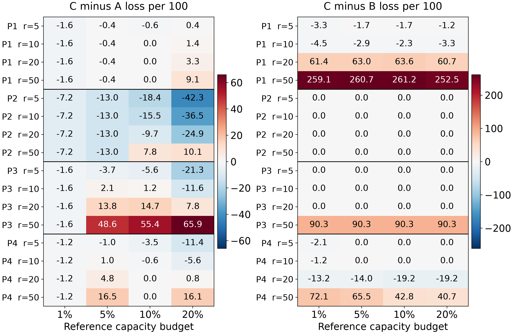
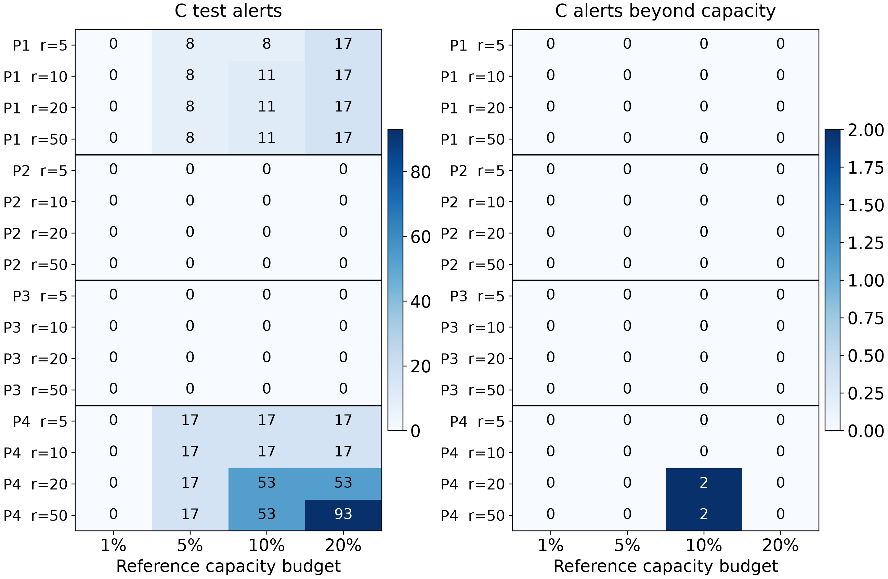

Cost- and Capacity-Sensitive Seismic Warning: A Retrospective Study of Threshold Transfer

Junjie Yang
Mining Engineering, Fuzhou University

Abstract

Historical capacity feasibility does not ensure that a seismic warning rule retains its workload or decision value on later records. This study separates model fitting, policy selection and testing to evaluate budget-only, cost-only and cost-plus-capacity rules on the UCI Seismic Bumps data. Four subsequent record blocks provide 2,063 test records. XGBoost is the prespecified main model; logistic regression and bagged CART provide robustness checks. At missed-event cost r=10, pooled cost-plus-capacity loss exceeded or equaled the no-alarm reference by 0.00 to 0.82 units per 100 shifts. Despite all reference areas containing positive outcomes, its 40 no-alarm selections comprise 28 unconstrained cost optima and 12 capacity-induced changes. The budget rule exceeded later capacity in 13 of 16 phase–budget settings; cost-plus-capacity exceeded it in 2 of 64 phase–budget–cost settings. Matched-setting comparisons connect reduced capacity excess to changes in detections, missed events and loss. Refitting changes finite-cutoff decisions, while no-alarm rules remain invariant by construction. Paired block intervals and frozen-rule prevalence scenarios characterize decision value and workload under hypothetical costs. Recorded row order is a temporal proxy; the study is retrospective.

Keywords: seismic hazard; warning threshold; relative cost; inspection capacity; record-order validation.

1 Research question and data

A warning score becomes an inspection decision through a threshold that trades missed hazardous shifts against false alerts. A cutoff selected under historical costs and capacity may trigger a different workload on later records. This study asks whether such rules reduce loss relative to no alarms, how their inspection demand transfers, and how model refitting changes decisions at the same cutoff. An alert identifies a candidate shift for inspection; the labels do not measure inspection effectiveness or avoided accidents.

UCI describes eight-hour shift summaries and a next-shift target indicating a seismic bump above 10⁴ J [1]. We retain the first-stage 2,578-row mirror, with 170 positives, and its full 17-column design. The official 2,584-row file contains six duplicate occurrences removed in the mirror; the first-stage source mapping identifies their retained first occurrences. Recorded row order is the temporal proxy because timestamps and operation identifiers are unavailable.

The analysis separates three questions: how cost and capacity determine historical selection, how the selected rules perform in later blocks, and how their decisions change after model refitting with the same cutoff. The protocol was locked before second-stage fitting. Because the cohort had already been inspected in stage one, the study is exploratory and retrospective. The previously viewed 774-row holdout provides supplementary evidence and overlaps part of the four-block cohort.

2 Historical selection and transfer design

Table 1. Disjoint areas, reference/test prevalence and training-only XGBoost choices

| Phase | Fit n | Ref n | Ref + | Ref % | Test n | Test + | Test % | Depth / rounds |
| --- | --- | --- | --- | --- | --- | --- | --- | --- |
| 1 | 412 | 103 | 21 | 20.39% | 516 | 36 | 6.98% | 2 / 80 |
| 2 | 824 | 207 | 1 | 0.48% | 515 | 10 | 1.94% | 2 / 160 |
| 3 | 1236 | 310 | 7 | 2.26% | 516 | 24 | 4.65% | 3 / 80 |
| 4 | 1649 | 413 | 20 | 4.84% | 516 | 18 | 3.49% | 3 / 80 |

For each outer historical prefix, the first 80% is the model-fitting area and the final 20% is the policy-reference area. XGBoost [2] selects depth {2, 3} and rounds {80, 160} on a further record-order 80/20 split inside the fitting area, using average precision; exact ties select the first grid entry. Learning rate is 0.05, minimum child weight 10 and L2 penalty 5, with full row and column sampling, two threads and seed 7. If that internal reference has no positives, negative Brier score is used. LR uses balanced class weights and penalty 1; bagged CART uses 60 unweighted trees, depth 6, minimum leaf size 20 and seed 7. Configurations are intentionally asymmetric and retained from stage one.

The fixed model is trained on the fitting area. Reference scores and labels determine a cutoff, which is frozen for the next test block. The refitted comparison uses the already selected parameters to fit all outer historical rows, including the policy-reference area, then applies the identical numerical cutoff to the identical test rows. Thresholds are selected using fixed-model reference scores and applied to raw scores in both workflows. Test labels enter only the subsequent evaluation.

Stage one [3] transfers a reference cutoff to an outer model refitted on all history; here fixed-model transfer is primary and refitting is a separate comparison. Stage-one XGBoost reference models use a separate parameter search, and budget cutoffs exclude boundary ties. Stage two reuses fitting-area parameters and canonical whole-group cutoffs. Cross-report alert counts require matched models, parameter selection, workflows and threshold definitions.

Table 2. Rules on the historical reference area

| Rule | Objective | Constraint |
| --- | --- | --- |
| A budget | Maximum whole-group alert count | Alerts ≤ floor(B Nref) |
| B cost | Minimum r FN + FP | None |
| C cost plus capacity | Minimum r FN + FP | Alerts ≤ floor(B Nref) |

Budgets are 1%, 5%, 10% and 20%; relative missed-event costs r are 5, 10, 20 and 50, with false-alarm cost 1. A is selected once per budget, B once per cost, and C once per combination. Alerts satisfy s ≥ τ. Tied scores move together. The cutoff is the minimum included reference score, except +∞ for no alarms and −∞ for all alarms. Equal-loss B/C decisions select fewer alerts. Zero capacity slots force A/C to +∞; without reference positives B/C select no alarms, while A remains budget-only.

The no-alarm baseline is always evaluated. Batch Top-k selects the largest whole-tie test-score set within floor(B Ntest), without test labels, and can underfill capacity. This retrospective ranking reference requires scores for the complete test batch; its capacity is enforced on that batch rather than inherited from a historical cutoff.

Primary loss is L100 = 100(r FN + FP)/N. Counts, recall, precision, alert rate and excess max(0, Alerts − floor(B N)) accompany it. Costs are hypothetical relative weights, not monetary estimates. Pooled slots and excess sum phase-specific quantities without offsetting excess in one phase against spare capacity in another.

3 Decision value relative to no alarms

Table 3. Pooled fixed XGBoost decision value at r=10

| Rule | Budget | L100 | Δ vs none | Alerts | TP | FN |
| --- | --- | --- | --- | --- | --- | --- |
| none | — | 42.66 | 0.00 | 0 | 0 | 88 |
| A | 1% | 45.52 | 2.86 | 59 | 0 | 88 |
| A | 5% | 45.90 | 3.25 | 166 | 9 | 79 |
| A | 10% | 47.21 | 4.56 | 248 | 14 | 74 |
| A | 20% | 56.33 | 13.67 | 557 | 25 | 63 |
| B | — | 44.06 | 1.41 | 414 | 35 | 53 |
| C | 1% | 42.66 | 0.00 | 0 | 0 | 88 |
| C | 5% | 43.33 | 0.68 | 25 | 1 | 87 |
| C | 10% | 43.48 | 0.82 | 28 | 1 | 87 |
| C | 20% | 43.24 | 0.58 | 34 | 2 | 86 |

The no-alarm rule provides an explicit decision reference: Lnone,100 = 100 r(TP + FN)/N. Relative loss is ΔLnone,100 = 100(FP − rTP)/N. Negative values indicate lower loss under the stated hypothetical cost. A and C budgets are historical selection limits; B has no capacity constraint. The cohort contains 2,063 shifts and 88 hazardous outcomes.

Table 4. Phase-specific loss relative to no alarms at r=10

| Phase | No-alarm L100 | A Δ range | B Δ | C Δ range |
| --- | --- | --- | --- | --- |
| 1 | 69.77 | -0.19 to 2.13 | 4.46 | 0.00 to 2.13 |
| 2 | 19.42 | 7.18 to 36.50 | 0.00 | 0.00 |
| 3 | 46.51 | -2.13 to 11.63 | 0.00 | 0.00 |
| 4 | 34.88 | 0.19 to 6.78 | 1.16 | 0.00 to 1.16 |

At this cost, pooled C loss equals the no-alarm loss at the 1% budget and is higher at the remaining budgets. Historical optimization is compatible with this outcome: reference labels determine the optimum, whereas later false alarms and detected hazards determine transferred value. At the 5%, 10% and 20% budgets, pooled C produces 24, 27 and 32 false alarms for 1, 1 and 2 detections, respectively; each exceeds the corresponding rTP benefit at r=10. Phase-specific results show where these contributions arise rather than attributing the pooled result to every stage.

This comparison separates relative advantage over another warning rule from value over no alarms. A capacity constraint can reduce inspection demand and improve loss relative to A while still producing positive ΔLnone,100. The complete decision-value files retain all costs, models, workflows and the descriptive holdout; r=10 is the common display scale used throughout the report.

4 Budget thresholds and future capacity

Table 5. Fixed XGBoost budget rule A across all phases and budgets

| Phase | Budget | Ref alerts | Test alerts | TP | FN | Excess | L100 r=10 |
| --- | --- | --- | --- | --- | --- | --- | --- |
| 1 | 1% | 1 | 8 | 0 | 36 | 3 | 71.32 |
| 1 | 5% | 5 | 10 | 0 | 36 | 0 | 71.71 |
| 1 | 10% | 10 | 11 | 0 | 36 | 0 | 71.90 |
| 1 | 20% | 20 | 21 | 2 | 34 | 0 | 69.57 |
| 2 | 1% | 2 | 37 | 0 | 10 | 32 | 26.60 |
| 2 | 5% | 10 | 67 | 0 | 10 | 42 | 32.43 |
| 2 | 10% | 20 | 113 | 3 | 7 | 62 | 34.95 |
| 2 | 20% | 41 | 254 | 6 | 4 | 151 | 55.92 |
| 3 | 1% | 3 | 8 | 0 | 24 | 3 | 48.06 |
| 3 | 5% | 15 | 55 | 6 | 18 | 30 | 44.38 |
| 3 | 10% | 31 | 71 | 7 | 17 | 20 | 45.35 |
| 3 | 20% | 62 | 170 | 10 | 14 | 67 | 58.14 |
| 4 | 1% | 4 | 6 | 0 | 18 | 1 | 36.05 |
| 4 | 5% | 20 | 34 | 3 | 15 | 9 | 35.08 |
| 4 | 10% | 41 | 53 | 4 | 14 | 2 | 36.63 |
| 4 | 20% | 82 | 112 | 7 | 11 | 9 | 41.67 |

The loss column uses r=10 as a common display scale; A itself never uses the cost ratio or labels to choose a cutoff. Each phase contains 515 or 516 test shifts. All 16 reference choices satisfied their own historical capacity limits.

Future capacity was exceeded in 13 of the 16 combinations. In phase 2, the 20% historical budget transferred to 254 alerts among 515 shifts, with 151 alerts beyond the 103 available slots. In phase 1, that same budget produced 21 alerts among 516 shifts, below the 103-slot limit. A budget therefore constrains historical selection rather than subsequent workload. Tied-score exclusions and changes in the score distribution can both separate the intended budget from its realized rate.

The workload difference accompanies a detection tradeoff. Phase 2 at the 20% budget detected 6 of 10 hazardous shifts and produced 248 false alarms; phase 1 detected 2 of 36 hazardous shifts with 19 false alarms. Reading these counts together shows how the same historical budget can yield both underused inspection capacity and substantial capacity excess in later stages.

The electronic evaluation table reports recall, precision and alert rate for every cost and workflow. Batch Top-k supplies a complementary reference: it enforces capacity using the observed test-batch scores, while the frozen threshold carries forward a historical selection. Their workload difference therefore reflects the information available when each rule is applied.

5 Cost and capacity change the selected decision

Figure 1. Fixed XGBoost loss contrasts for every phase, cost and capacity budget. Negative values favor C on the stated relative loss. Panels use separate color scales; cell values are rounded to one decimal.

Across the 64 phase–budget–cost combinations, C−A ranged from -42.33 to 65.89 relative loss units per 100 shifts and C−B from -19.19 to 261.24. Strategy preference depends on the record stage and assumed missed-event cost: the same capacity-constrained rule can reduce loss in one setting and increase it in another.

In phase 2, both B and C selected no alarms for every cost, so C−B is zero. The same decision can lower loss relative to A when r is modest and increase it when missed events carry a higher assumed cost. In phase 1, C reduces inspection work compared with the large alert set chosen by B at higher costs, while accepting more missed hazardous shifts. The positive C−B difference is the observed loss tradeoff after transferring the capacity-constrained rule, not a guaranteed penalty of capacity constraints.

At r=10 and the 20% reference budget, pooled C−A reduced excess by 227 alerts but also reduced detections from 25 to 2, increasing misses from 63 to 86. Relative loss fell by 13.09 per 100 shifts. This is a workload–detection tradeoff; Table A1 presents each phase and budget, and Section 3 gives the separate no-alarm comparison.

On the reference area, C has loss at least as large as B because its feasible candidate set is a subset; every saved selection satisfies this ordering. After transfer, the ordering can reverse. Historical optimization and subsequent evaluation thus answer distinct questions: the first identifies the best feasible reference decision, and the second measures how that decision performs on later records.

6 Workload and historical no-alarm selection

Figure 2. Workload and capacity excess for the same fixed XGBoost C policies shown in Figure 1. Zero alerts and zero excess are distinct outcomes. Counts refer to whole test blocks, not rates.

C produced no alarms in 40 of 64 settings, all following a historical no-alarm selection. Its 2 excess-capacity settings and A’s 13 use different denominators; these are grid summaries, not directly comparable independent violation rates. The matched C−A table in the appendix pairs capacity excess with detection and loss.

Table 6. Historical reasons for all 40 fixed XGBoost C no-alarm settings

| Phase | No ref + | Cost optimum | Capacity change | Zero slots | Other optimal tie |
| --- | --- | --- | --- | --- | --- |
| 1 | 0 | 0 | 4 | 0 | 0 |
| 2 | 0 | 16 | 0 | 0 | 0 |
| 3 | 0 | 12 | 4 | 0 | 0 |
| 4 | 0 | 0 | 4 | 0 | 0 |

All reference areas contain hazardous shifts: 28 no-alarm settings are cost optima and 12 are capacity-induced changes; none has zero slots or an optimal tie. In phase 3 at r=50, B selects alarms while C selects none at every budget. Reasons use reference records only.

Table 7. Reference capacity and standardized selection margin

| Phase | Unconstrained cost optimum exceeds reference capacity | Next-decision ΔL100 range |
| --- | --- | --- |
| 1 | 16 | 0.97 to 42.72 |
| 2 | 0 | 0.48 |
| 3 | 4 | 0.32 |
| 4 | 10 | 0.24 to 9.69 |

The capacity column counts infeasible B optima; C utilization is stored separately. The margin is 100(Lnext − Lbest)/Nref for a second distinct feasible alarm set, undefined if absent and zero for ties. A small margin indicates weak reference advantage, not threshold instability. The enriched audit retains alerts and slots.

7 Transferring the same cutoff to a refitted model

Figure 3. C policy changes after fitting on all outer history, with parameters and numerical thresholds held fixed. Negative loss differences favor refitting; negative alert differences mean fewer inspections. Alert-count changes in the second panel are labelled as integers.

For C, refitted-minus-fixed loss ranged from -11.05 to 7.75 per 100 shifts and alert changes from -11 to 2 per test block. Phase 2 and phase 3 C decisions remained no-alarm under both workflows. Phase 1 and phase 4 show that the same numerical cutoff can produce different workloads and loss after additional model fitting.

Table 8. XGBoost refitting across all historically finite and extreme rules

| Rule | Finite | +∞ | −∞ | Finite ΔL100 range | Finite Δ alerts |
| --- | --- | --- | --- | --- | --- |
| A | 16 | 0 | 0 | -18.83 to 18.22 | -97 to 82 |
| B | 9 | 7 | 0 | -17.64 to 18.80 | -25 to 119 |
| C | 24 | 40 | 0 | -11.05 to 7.75 | -11 to 2 |

Counts are distinct phase–rule settings: A = phase × budget (4 × 4 = 16); B = phase × cost (4 × 4 = 16); C = phase × budget × cost (4 × 4 × 4 = 64). A is reused across costs. Ranges evaluate finite settings at all four costs. Extreme rules stay unchanged by construction, providing no evidence of finite-cutoff robustness. The appendix retains every A/B/C contrast.

Refitting changes the model to which the historical rule is applied. Adding historical records, including the former policy-reference area, can alter both the fitted decision function and its score scale. The comparison measures their combined workflow difference rather than isolating a causal contribution. Since selection and application use raw scores throughout, the results specifically describe numerical-cutoff transfer across fitted models.

Within the observed settings, C exhibited a narrower finite-threshold alert-change range. This describes the tested rule grids. Batch Top-k remains outside the same-cutoff comparison because each complete test-score batch determines its own threshold.

8 Paired uncertainty and model robustness

For each prespecified loss contrast, 2,000 paired moving-block samples use block length 32 separately within phases [4], without cross-phase or circular blocks. Both policies use the same sampled rows, and pooled resampling preserves phase sizes. Percentile 95% intervals condition on the fitted models, chosen thresholds and observed cohort, excluding tuning, fitting and policy-selection uncertainty. Identical paired decisions yield degenerate zero intervals.

Table 9. Phase-specific interval directions across all 16 settings per contrast

| Contrast | Phase | Point range | CI below 0 | CI above 0 | CI contains 0 |
| --- | --- | --- | --- | --- | --- |
| C−A | 1 | -1.55 to 9.11 | 4 | 0 | 12 |
| C−A | 2 | -42.33 to 10.10 | 13 | 0 | 3 |
| C−A | 3 | -21.32 to 65.89 | 6 | 5 | 5 |
| C−A | 4 | -11.43 to 16.47 | 5 | 0 | 11 |
| C−B | 1 | -4.46 to 261.24 | 0 | 4 | 12 |
| C−B | 2 | 0.00 | 0 | 0 | 16 |
| C−B | 3 | 0.00 to 90.31 | 0 | 4 | 12 |
| C−B | 4 | -19.19 to 72.09 | 0 | 2 | 14 |
| Refitted−Fixed C | 1 | -1.16 to 7.75 | 3 | 0 | 13 |
| Refitted−Fixed C | 2 | 0.00 | 0 | 0 | 16 |
| Refitted−Fixed C | 3 | 0.00 | 0 | 0 | 16 |
| Refitted−Fixed C | 4 | -11.05 to 0.39 | 0 | 0 | 16 |

The full file reports the point and both interval endpoints for each individual setting, alongside alert and excess differences. Table 9 summarizes the grid rather than averaging unlike costs; interval counts are descriptive and have no multiple-comparison adjustment. B−A is retained as a secondary contrast.

For illustration, hold XGBoost, r=10 and budget 20% fixed. Phase 1 C−A is +1.36 per 100 shifts (95% CI [-0.97, 5.43]); phase 2 is -36.50 ([-49.13, -27.18]). The positive phase-1 point estimate has an interval containing zero; the phase-2 interval is entirely negative. These existing intervals illustrate stage-specific uncertainty without selecting an operating rule.

Table 10. Robustness models across the same 16 C settings in each phase

| Model | Phase | C−A L100 range | Alert range | Excess policies | No-alarm policies |
| --- | --- | --- | --- | --- | --- |
| LR | 1 | -3.29 to 0.00 | 2–30 | 0 | 0 |
| LR | 2 | -47.38 to 22.52 | 0–0 | 0 | 16 |
| LR | 3 | -20.93 to 92.44 | 0–0 | 0 | 16 |
| LR | 4 | -18.60 to 9.11 | 4–81 | 3 | 0 |
| CART | 1 | -0.19 to 9.11 | 0–26 | 0 | 4 |
| CART | 2 | -37.09 to 15.34 | 0–0 | 0 | 16 |
| CART | 3 | -14.92 to 34.69 | 0–55 | 1 | 14 |
| CART | 4 | -13.95 to 7.17 | 0–92 | 3 | 7 |

LR and CART extend the policy comparison across retained baseline models using identical reference boundaries, selection rules and test rows. Their stage-dependent loss and workload ranges show how the tradeoffs vary across fitted score distributions. Model configurations follow the asymmetric first-stage design described in Section 2. Full fixed/refitted and no-alarm comparisons appear in the electronic appendix.

9 Frozen prevalence scenarios and decision implications

The scenario changes hazardous-shift prevalence π to 2%, 5%, 10% or 15%, holding policies and empirical class-conditional error rates fixed. Expected loss is L100(π) = 100[r π FNR + (1 − π) FPR]; expected alert rate is π(1 − FNR) + (1 − π)FPR. Cutoffs remain frozen. These prevalence-only expectations exclude within-class changes and do not estimate capacity-exceedance probability.

Table 11. Pooled prior-shift sensitivity: relative C loss and expected workload

| Cost r | π 2% | π 5% | π 10% | π 15% |
| --- | --- | --- | --- | --- |
| 5 | 0.00 to 1.36 0.00 to 1.63% | 0.00 to 0.97 0.00 to 1.65% | 0.00 to 0.53 0.00 to 1.69% | -0.33 to 0.18 0.00 to 1.72% |
| 10 | 0.00 to 1.13 0.00 to 1.63% | 0.00 to 0.73 0.00 to 1.65% | -0.81 to 0.09 0.00 to 1.69% | -2.03 to 0.00 0.00 to 1.72% |
| 20 | 0.00 to 1.16 0.00 to 3.34% | -2.56 to 0.02 0.00 to 3.41% | -8.40 to 0.00 0.00 to 3.53% | -14.25 to 0.00 0.00 to 3.65% |
| 50 | -1.66 to 0.05 0.00 to 5.30% | -12.04 to 0.00 0.00 to 5.34% | -29.35 to 0.00 0.00 to 5.42% | -46.66 to 0.00 0.00 to 5.50% |

Each cell ranges across four budgets: first ΔLnone,100(π) = Lpolicy,100(π) − 100rπ, then expected alert percentage. Negative differences mean lower hypothetical loss. These marginal endpoints need not share a budget; Table A5 pairs values by budget at r=10. Absolute losses and per-phase expectations remain in the appendices.

Table 12. Previously viewed holdout and all 16 C settings

| Model | Workflow | L100 minus no alarm range | Alert range | Excess policies |
| --- | --- | --- | --- | --- |
| XGBoost | fixed | -31.40 to 0.00 | 0–63 | 0 |
| XGBoost | refitted | -20.16 to 0.52 | 0–48 | 0 |
| LR | fixed | -25.84 to 0.00 | 0–55 | 0 |
| LR | refitted | -15.25 to 0.00 | 0–35 | 0 |
| CART | fixed | -35.40 to 0.00 | 0–83 | 0 |
| CART | refitted | -25.71 to 0.13 | 0–56 | 0 |

10 Discussion and conclusions

Reference-to-test hazardous-shift prevalence changes were phase 1: 20.39% → 6.98%; phase 2: 0.48% → 1.94%; phase 3: 2.26% → 4.65%; phase 4: 4.84% → 3.49%. Phase 2 reference choices rest on 1 hazardous outcome among 207 records. This sparse reference and the prevalence differences provide plausible context for transfer behavior. Class-conditional score distributions may also change; the design does not identify prevalence shift as its sole cause. Section 9 assumes prevalence-only change without identifying it causally.

Decision value depends on the comparator as well as the assumed cost. At r=10, C can reduce loss relative to A while its pooled false-alert cost balances or exceeds its detection benefit relative to no alarms. Its 40 historical no-alarm choices comprise 28 unconstrained cost optima and 12 capacity-induced changes, despite positive reference outcomes. Lower capacity excess must also be read alongside detection: the matched C−A comparisons show the accompanying changes in TP, FN and loss. Refitting changes finite-cutoff decisions; the unchanged no-alarm rules reflect their definition and provide no evidence about finite-threshold transfer.

Historical selection supplies a rule's rationale; later detections, misses and false alerts determine its transferred value. Joint evaluation reveals capacity excess and refitting differences alongside loss. Costs are hypothetical, and capacity counts shifts requiring inspection. Frozen scenarios hold class-conditional rates fixed. Operational validation requires dated monitoring and inspection outcomes.

Appendix A Detection, capacity and pooled evidence

Table A1. Matched C−A capacity, detection and loss differences at r=10

| Phase | Budget | Δ alerts | Δ excess | Δ TP | Δ FN | Δ L100 |
| --- | --- | --- | --- | --- | --- | --- |
| 1 | 1% | -8 | -3 | 0 | 0 | -1.55 |
| 1 | 5% | -2 | 0 | 0 | 0 | -0.39 |
| 1 | 10% | 0 | 0 | 0 | 0 | 0.00 |
| 1 | 20% | -4 | 0 | -1 | 1 | 1.36 |
| 2 | 1% | -37 | -32 | 0 | 0 | -7.18 |
| 2 | 5% | -67 | -42 | 0 | 0 | -13.01 |
| 2 | 10% | -113 | -62 | -3 | 3 | -15.53 |
| 2 | 20% | -254 | -151 | -6 | 6 | -36.50 |
| 3 | 1% | -8 | -3 | 0 | 0 | -1.55 |
| 3 | 5% | -55 | -30 | -6 | 6 | 2.13 |
| 3 | 10% | -71 | -20 | -7 | 7 | 1.16 |
| 3 | 20% | -170 | -67 | -10 | 10 | -11.63 |
| 4 | 1% | -6 | -1 | 0 | 0 | -1.16 |
| 4 | 5% | -17 | -9 | -2 | 2 | 0.97 |
| 4 | 10% | -36 | -2 | -3 | 3 | -0.58 |
| 4 | 20% | -95 | -9 | -6 | 6 | -5.62 |

Every difference is C minus A on the same test rows, with the same historical budget and assumed cost. Negative excess means fewer over-capacity alerts; negative TP means fewer detections, and ΔFN = −ΔTP. Loss and detection differences retain their signs rather than treating fewer alarms as intrinsically better. The complete capacity_tradeoffs file includes both workflows, all costs, all models, pooled results and the descriptive holdout.

Table A2. Supplementary pooled fixed XGBoost and batch-reference results at r=10

| Rule | Budget | L100 | Alerts | TP | FP | FN | Excess |
| --- | --- | --- | --- | --- | --- | --- | --- |
| none | — | 42.66 | 0 | 0 | 0 | 88 | — |
| A | 1% | 45.52 | 59 | 0 | 59 | 88 | 39 |
| A | 5% | 45.90 | 166 | 9 | 157 | 79 | 81 |
| A | 10% | 47.21 | 248 | 14 | 234 | 74 | 84 |
| A | 20% | 56.33 | 557 | 25 | 532 | 63 | 227 |
| C | 1% | 42.66 | 0 | 0 | 0 | 88 | 0 |
| C | 5% | 43.33 | 25 | 1 | 24 | 87 | 0 |
| C | 10% | 43.48 | 28 | 1 | 27 | 87 | 0 |
| C | 20% | 43.24 | 34 | 2 | 32 | 86 | 0 |
| TopK | 1% | 43.63 | 20 | 0 | 20 | 88 | 0 |
| TopK | 5% | 43.77 | 100 | 7 | 93 | 81 | 0 |
| TopK | 10% | 45.08 | 204 | 14 | 190 | 74 | 0 |
| TopK | 20% | 46.05 | 411 | 31 | 380 | 57 | 0 |

The pooled cohort has 2,063 records and 88 hazardous shifts. Table A2 supplies a common cost scale for retrospective batch ranking. Capacity excess sums stage-specific counts. A and Top-k selections do not depend on r; Table 3 additionally presents the unconstrained cost rule B and no-alarm loss differences.

Appendix B Refitting and pooled prior shift

Table A3. Phase-specific XGBoost A/B/C refitting with historical threshold groups

| Phase | Rule | Finite | +∞ | −∞ | Finite ΔL100 range | Finite Δ alerts |
| --- | --- | --- | --- | --- | --- | --- |
| 1 | A | 4 | 0 | 0 | -1.16 to 17.05 | -14 to -4 |
| 1 | B | 4 | 0 | 0 | -1.36 to 18.80 | -25 to 119 |
| 1 | C | 12 | 4 | 0 | -1.16 to 7.75 | -11 to -4 |
| 2 | A | 4 | 0 | 0 | -18.83 to 11.84 | -97 to -6 |
| 2 | B | 0 | 4 | 0 | — | — |
| 2 | C | 0 | 16 | 0 | — | — |
| 3 | A | 4 | 0 | 0 | -13.76 to 18.22 | -8 to 82 |
| 3 | B | 1 | 3 | 0 | -17.64 | 62 to 62 |
| 3 | C | 0 | 16 | 0 | — | — |
| 4 | A | 4 | 0 | 0 | -5.23 to 3.49 | -5 to 24 |
| 4 | B | 4 | 0 | 0 | -1.36 to 0.58 | -7 to 66 |
| 4 | C | 12 | 4 | 0 | -11.05 to 0.39 | -6 to 2 |

Groups follow historical threshold choices and retain zero changes. Extreme rules have invariant decisions. refit_transfer.csv contains all 540 A/B/C contrasts across three models, four phases and the descriptive holdout; comparisons.csv retains the original primary-cohort paired intervals.

Table A4. Pooled expected absolute C loss per 100 across four historical budgets

| Cost r | π 2% | π 5% | π 10% | π 15% |
| --- | --- | --- | --- | --- |
| 5 | 10.00 to 11.36 | 25.00 to 25.97 | 50.00 to 50.53 | 74.67 to 75.18 |
| 10 | 20.00 to 21.13 | 50.00 to 50.73 | 99.19 to 100.09 | 147.97 to 150.00 |
| 20 | 40.00 to 41.16 | 97.44 to 100.02 | 191.60 to 200.00 | 285.75 to 300.00 |
| 50 | 98.34 to 100.05 | 237.96 to 250.00 | 470.65 to 500.00 | 703.34 to 750.00 |

Appendix C Budget-specific prior shift and reproducibility

Table A5. Budget-specific pooled fixed XGBoost C prior-shift results at r=10

| Historical budget | π 2% | π 5% | π 10% | π 15% |
| --- | --- | --- | --- | --- |
| 1% | 0.00 0.00% | 0.00 0.00% | 0.00 0.00% | 0.00 0.00% |
| 5% | 0.96 1.21% | 0.59 1.21% | -0.04 1.21% | -0.67 1.20% |
| 10% | 1.11 1.36% | 0.73 1.36% | 0.09 1.34% | -0.54 1.33% |
| 20% | 1.13 1.63% | 0.40 1.65% | -0.81 1.69% | -2.03 1.72% |

Each cell pairs relative loss per 100 shifts (first line) with expected alert percentage (second line) for the same historical budget and scenario. Negative loss differences favor the policy over no alarms under r=10. All sixteen entries use frozen class-conditional error rates and historical rules; no scenario selects a new threshold. The complete electronic file retains every model, cost, workflow and phase.

Reproducibility and electronic appendix

The protocol was locked on 2 October 2026 at 19:20:26 UTC; its hash starts 85a1a16b30a5b9ac. Independent reproduction replayed all 15 model pairs and paired resampling. The results/phase2 appendix retains predictions, references, candidates, audits, evaluations, comparisons, bootstrap arrays and row manifests. Infinite thresholds are sentinels; empty cells denote undefined quantities.

Frozen-rule descriptive outputs include decision_value files for no-alarm references, threshold_explanations and threshold_audit_enriched for causes and margins, refit_transfer and capacity_tradeoffs for complete contrasts, and prevalence_decision_value for scenario loss and workload. Separate manifests and checks establish provenance.

Code, commands and complete evidence: https://github.com/junjie-yang11/seismic-bump-forecasting. Tables and figures are generated from verified result files.

References

[1] Sikora M, Wrobel L. seismic-bumps. UCI Machine Learning Repository; 2010. doi:10.24432/C5W902. https://archive.ics.uci.edu/dataset/266/seismic+bumps.

[2] Chen T, Guestrin C. XGBoost: A Scalable Tree Boosting System. KDD; 2016. doi:10.1145/2939672.2939785.

[3] Yang J. Evaluating reliability and explainability in seismic hazard forecasting for underground mine monitoring. Technical report; 2026. Companion stage-one paper: reports/phase1/technical_report.pdf in the project repository.

[4] Künsch HR. The Jackknife and the Bootstrap for General Stationary Observations. The Annals of Statistics; 1989;17(3):1217–1241. doi:10.1214/aos/1176347265.
